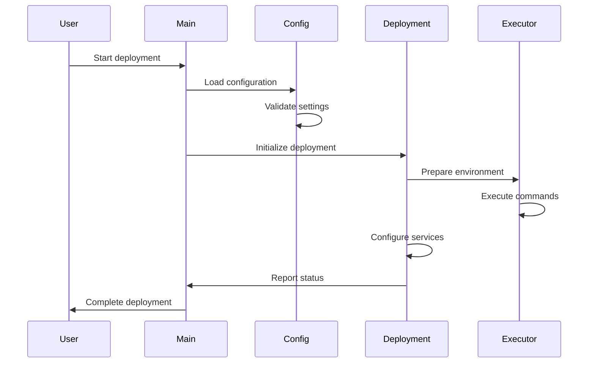

# Code Architecture Documentation

## Project Structure

```
deploy_py/
├── main.py                 # Main entry point of the deployment system
├── python/                 # Python implementation directory
│   ├── config_management/ # Configuration management modules
│   ├── deploy/           # Deployment implementation
│   ├── executor/         # Command execution modules
│   ├── utils/            # Utility functions
│   ├── common/           # Common modules (logging, constants, etc.)
│   └── exceptions/       # Custom exception definitions
└── shell/                # Shell scripts directory
    └── utils/           # Shell utility scripts

```

## Core Components

### 1. Main Application (`main.py`)

The main entry point of the deployment system, responsible for:

- Command line argument parsing
- Deployment mode selection (Docker/Bare metal)
- Configuration generation
- Orchestration of the deployment process

Key Classes and Functions:

```python
class MainApplication:
    """
    Main application class that orchestrates the deployment process.
    Handles command-line arguments and coordinates different deployment modes.
    """
    
    def __init__(self):
        """
        Initialize the application with:
        - Command line arguments
        - OS information
        - Path management
        - Deployment manager
        - Command executor
        """
        
    def parse_arguments(self):
        """
        Parse command line arguments including:
        - deploy: Regular deployment mode
        - docker-deploy: Docker-based deployment
        - generate-conf: Configuration generation
        - os-info: Operating system information
        - docker-instance-num: Number of Docker instances
        """
        
    def deploy_cluster_if_needed(self):
        """
        Execute cluster deployment based on selected mode:
        - Regular deployment (bare metal/KVM)
        - Docker-based deployment
        """
        
    def generate_conf_if_needed(self):
        """
        Generate configuration files if requested
        - Converts base_conf.yml to detailed conf.yml
        - Generates necessary templates
        """
```

### 2. Configuration Management

The configuration management module handles:

- Base configuration parsing
- Advanced configuration generation
- Template rendering
- Configuration validation

Key Components:
- YAML configuration parsing
- Jinja2 template processing
- Configuration validation rules
- Environment-specific settings

### 3. Deployment Module

Handles the actual deployment process with two main modes:

#### Docker Deployment Flow:
1. Parse configuration
2. Generate Docker Compose file
3. Create and configure containers
4. Execute deployment scripts in containers
5. Configure services and components

#### Bare Metal/KVM Deployment Flow:
1. Parse configuration
2. Validate environment
3. Execute Ansible playbooks
4. Configure services directly

### 4. Executor Module

Responsible for command execution and process management:

- Command execution in different environments
- Process management and monitoring
- Error handling and logging
- Status reporting

### 5. Common Utilities

Shared functionality across the system:

- Logging configuration
- Path management
- Constants and configurations
- Error handling

## Deployment Process Flow



## Configuration Files

### Base Configuration (base_conf.yml)
```yaml
# Basic deployment configuration
default_password: 'password'
data_dirs: ["/data1", "/data2"]
components_to_install: ["hdfs", "yarn", "hive"]

# Host configuration
hosts:
  - 192.168.1.101 node1
  - 192.168.1.102 node2

# Docker specific settings
docker_options:
  instance_num: 4
  memory_limit: "16g"
```

### Generated Configuration (conf.yml)
```yaml
# Detailed configuration generated from base_conf.yml
cluster_config:
  name: "cluster_name"
  components:
    hdfs:
      data_dirs: ["/data1/hdfs", "/data2/hdfs"]
    yarn:
      resource_manager: "node1"
      node_managers: ["node2"]
```

## Error Handling

The system implements comprehensive error handling:

1. Configuration Validation
   - Schema validation
   - Dependency checking
   - Resource validation

2. Deployment Errors
   - Network connectivity issues
   - Resource allocation failures
   - Service startup failures

3. Recovery Mechanisms
   - Rollback procedures
   - Clean-up operations
   - Error reporting and logging

## Best Practices

1. Configuration Management
   - Use base_conf.yml for basic settings
   - Review generated conf.yml
   - Validate before deployment

2. Deployment Process
   - Start with small clusters
   - Verify network connectivity
   - Monitor resource usage

3. Troubleshooting
   - Check logs regularly
   - Verify configurations
   - Monitor system resources

## Development Guidelines

1. Code Structure
   - Follow modular design
   - Maintain separation of concerns
   - Document all major functions

2. Error Handling
   - Use custom exceptions
   - Implement proper logging
   - Provide meaningful error messages

3. Testing
   - Unit test critical components
   - Integration test deployment flows
   - Validate configurations 