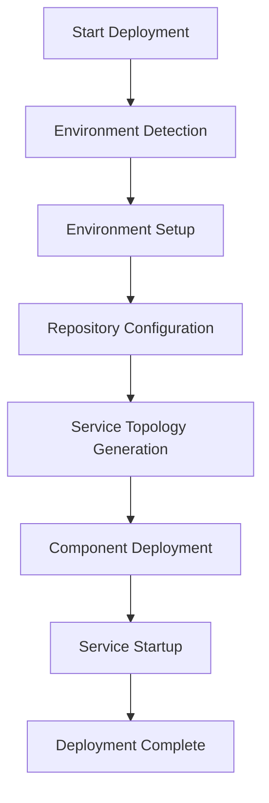

# Project Overview

## Introduction

This is an automated deployment system specifically designed for managing and deploying large-scale distributed systems. The system supports multiple operating system environments (Ubuntu, CentOS, Rocky Linux) and provides flexible service topology management and configuration capabilities.

## Core Features

1. **Multi-Environment Support**
   - Ubuntu environment configuration and deployment
   - CentOS/Rocky Linux environment configuration and deployment
   - Special handling for Docker environments

2. **Service Topology Management**
   - Automatic cluster deployment topology generation
   - Support for 3-node and multi-node cluster configurations
   - Intelligent service distribution algorithm

3. **Configuration Management**
   - Service mapping configuration
   - Component dependency management
   - Environment-specific configurations

4. **Command Execution System**
   - Unified command execution interface
   - Log management and error handling
   - Environment variable management

## Technical Architecture

### System Components

1. **Configuration Management Module** (`config_management/`)
   - `topology_manager.py`: Manages cluster topology
   - `service_map.py`: Service component mapping

2. **Executor Module** (`executor/`)
   - `command_executor.py`: Command execution management

3. **Environment Setup Scripts** (`shell/utils/`)
   - `setup-env-ubuntu.sh`: Ubuntu environment configuration
   - `setup-env-centos.sh`: CentOS environment configuration
   - `setup_repo.sh`: Repository configuration

### System Flow



## Deployment Process

1. **Environment Preparation**
   - System requirements check
   - Dependency package installation
   - SSH configuration

2. **Repository Configuration**
   - YUM/APT repository setup
   - Package index generation
   - HTTP service configuration

3. **Service Deployment**
   - Topology generation
   - Component distribution
   - Service configuration
   - Startup verification

## Development Guide

### Code Structure

```
deploy/
├── docs/                 # Project documentation
├── deploy_py/           # Python main program
│   ├── python/         # Python modules
│   │   ├── config_management/  # Configuration management
│   │   ├── executor/   # Executor
│   │   └── common/     # Common components
│   └── shell/         # Shell scripts
│       └── utils/     # Utility scripts
```

### Development Standards

1. **Code Style**
   - Follow PEP 8 guidelines
   - Use type hints
   - Detailed docstrings

2. **Error Handling**
   - Unified exception handling mechanism
   - Detailed error logging
   - Graceful failure handling

3. **Testing Requirements**
   - Unit test coverage
   - Integration testing
   - Environment compatibility testing

## Maintenance Guide

1. **Routine Maintenance**
   - Log monitoring
   - Performance optimization
   - Configuration updates

2. **Troubleshooting**
   - Error diagnosis process
   - Recovery strategies
   - Emergency response plans

3. **Upgrade Process**
   - Version control
   - Upgrade steps
   - Rollback mechanisms

## Contributing Guide

1. **Submission Guidelines**
   - Branch management strategy
   - Commit message format
   - Code review process

2. **Documentation Maintenance**
   - Documentation update requirements
   - Version history
   - Change notes 