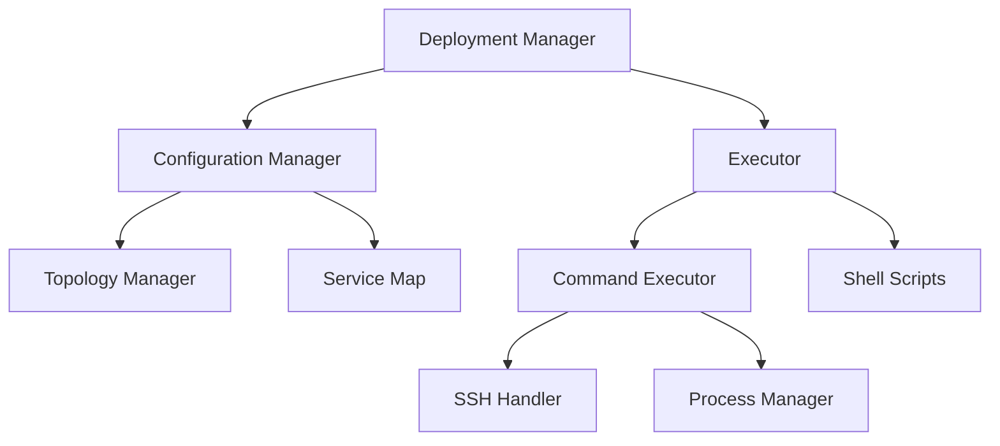
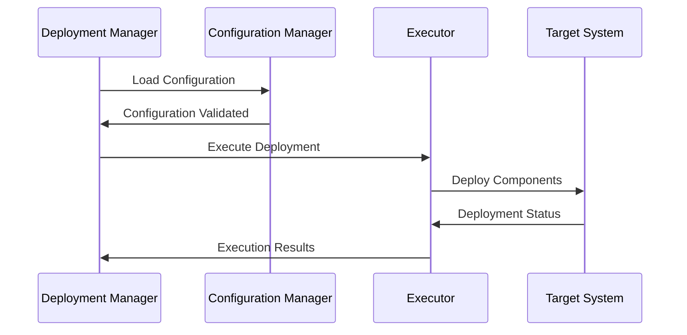
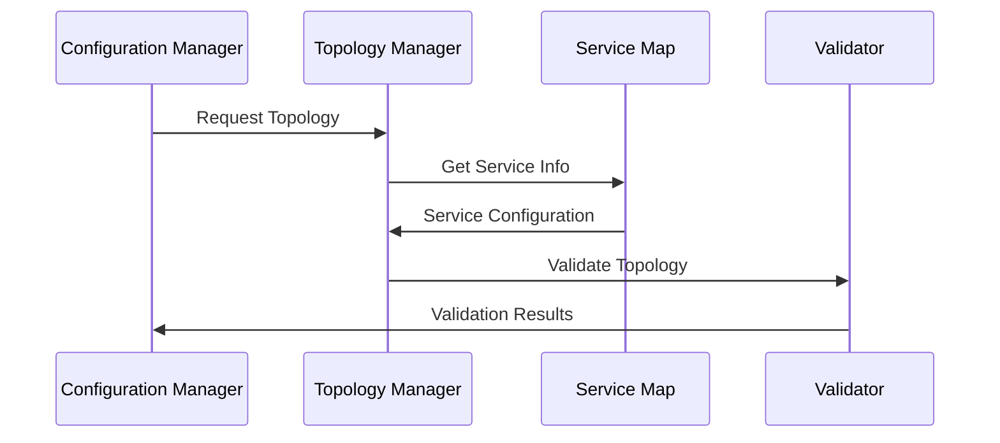

# Technical Architecture

## System Overview

### Architecture Diagram


## Core Components

### 1. Deployment Manager
- **Purpose**: Orchestrates the entire deployment process
- **Key Features**:
  - Deployment workflow management
  - State management
  - Error handling and recovery
- **Dependencies**:
  - Configuration Manager
  - Executor

### 2. Configuration Manager
- **Purpose**: Manages system configuration and service topology
- **Components**:
  - Topology Manager
  - Service Map
- **Key Features**:
  - Configuration validation
  - Service dependency resolution
  - Environment-specific settings

### 3. Executor
- **Purpose**: Executes deployment commands and scripts
- **Components**:
  - Command Executor
  - Shell Scripts
  - Process Manager
- **Features**:
  - Remote command execution
  - Process management
  - Error handling

## Technical Details

### 1. Configuration Management

#### Service Map
```python
class ServiceMap:
    def __init__(self):
        self.services = {}
        self.dependencies = {}
    
    def get_service_info(self, service_name: str) -> Dict:
        # Returns service configuration
        pass
    
    def validate_dependencies(self) -> bool:
        # Validates service dependencies
        pass
```

#### Topology Manager
```python
class TopologyManager:
    def __init__(self):
        self.nodes = []
        self.service_distribution = {}
    
    def generate_topology(self) -> Dict:
        # Generates deployment topology
        pass
    
    def validate_topology(self) -> bool:
        # Validates topology configuration
        pass
```

### 2. Command Execution

#### Command Executor
```python
class CommandExecutor:
    def __init__(self):
        self.ssh_handler = SSHHandler()
        self.process_mgr = ProcessManager()
    
    def execute_remote(self, command: str, host: str) -> Result:
        # Executes command on remote host
        pass
    
    def execute_local(self, command: str) -> Result:
        # Executes command locally
        pass
```

#### SSH Handler
```python
class SSHHandler:
    def __init__(self):
        self.connections = {}
    
    def connect(self, host: str, credentials: Dict) -> bool:
        # Establishes SSH connection
        pass
    
    def execute_command(self, command: str) -> Result:
        # Executes command over SSH
        pass
```

## Data Flow

### 1. Deployment Flow


### 2. Configuration Flow


## Security Architecture

### 1. Authentication
- SSH key-based authentication
- Role-based access control
- Secure credential storage

### 2. Network Security
- Encrypted communication
- Port-level security
- Network isolation

### 3. Data Security
- Configuration encryption
- Secure storage
- Audit logging

## Performance Considerations

### 1. Scalability
- Distributed deployment support
- Load balancing
- Resource optimization

### 2. Reliability
- Fault tolerance
- Automatic recovery
- State persistence

### 3. Monitoring
- Performance metrics
- Health checks
- Log aggregation

## Integration Points

### 1. External Systems
- Package repositories
- Monitoring systems
- Log aggregators

### 2. APIs
- REST APIs for control
- Webhook integration
- Metric export

## Development Guidelines

### 1. Code Organization
```
src/
├── config/
│   ├── topology.py
│   └── service_map.py
├── executor/
│   ├── command.py
│   └── ssh.py
└── utils/
    ├── validation.py
    └── logging.py
```

### 2. Best Practices
- Type hints usage
- Error handling patterns
- Logging standards
- Testing requirements

### 3. Development Workflow
- Branch management
- Code review process
- CI/CD integration
- Documentation updates

## Deployment Environments

### 1. Development
- Local deployment
- Mock services
- Debug logging

### 2. Staging
- Production-like environment
- Test data
- Performance testing

### 3. Production
- High availability
- Monitoring
- Backup and recovery

## Future Considerations

### 1. Planned Improvements
- Container orchestration
- Service mesh integration
- Advanced monitoring

### 2. Scalability Plans
- Multi-region support
- Auto-scaling
- Load distribution

### 3. Technology Evolution
- Framework updates
- Security enhancements
- Performance optimization 